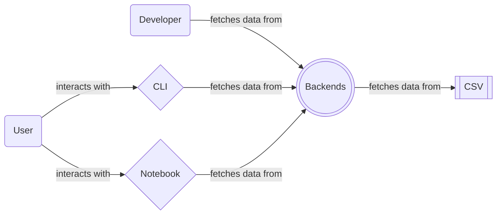

```mermaid
flowchart LR
    U(User) -->|interacts with| C{CLI}
    U -->|interacts with| N{Notebook}
    D(Developer) -->|fetches data from| B(((Backends)))
    C -->|fetches data from| B
    N -->|fetches data from| B
    B -->|fetches data from| CSV[[CSV]]
```
